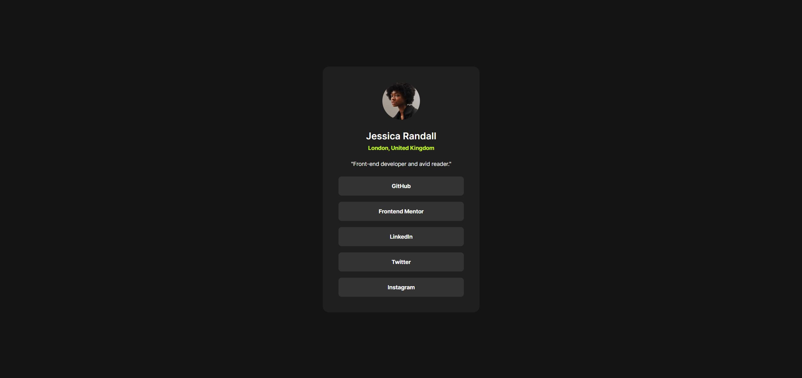

# Frontend Mentor - Social Links Profile Solution

This is my solution to the [Social Links Profile challenge on Frontend Mentor](https://www.frontendmentor.io/challenges/social-links-profile-UG32l9m6dQ). It's a simple, responsive profile card built with HTML and CSS, aimed at improving skills in layout, responsiveness, and component styling.

## Table of Contents

- [Overview](#overview)
  - [The Challenge](#the-challenge)
  - [Screenshot](#screenshot)
  - [Links](#links)
- [My Process](#my-process)
  - [Built With](#built-with)
  - [What I Learned](#what-i-learned)
  - [Continued Development](#continued-development)
  - [Useful Resources](#useful-resources)
- [Author](#author)

## Overview

### The Challenge

Users should be able to:

- View a centered profile card with social links
- See hover states for interactive elements

### Screenshot



### Links

- Solution URL: [GitHub Repository](https://github.com/LelloX-Dev/social-links-profile-repo)
- Live Site URL: [Live Preview](https://lellox-dev.github.io/social-links-profile-repo/)

## My Process

### Built With

- Semantic HTML5 markup
- CSS custom properties (variables)
- Flexbox
- Mobile-first responsive design
- Local custom fonts via `@font-face`

### What I Learned

This project helped reinforce responsive layouts using Flexbox and improved my understanding of hover effects and color variables.

```css
.links a:hover {
  background-color: var(--Green--);
  color: var(--Grey-700--);
  cursor: pointer;
}
```

Also practiced font loading with custom fonts:

```css
@font-face {
  font-family: "Inter";
  src: url("./assets/fonts/Inter-VariableFont_slnt\,wght.ttf") format("truetype");
  font-weight: 100 900;
}
```

### Continued Development

I’d like to:

- Add dark/light theme toggle
- Implement accessibility improvements (like better focus outlines)
- Recreate this layout using a JavaScript framework for practice (React or Vue)

### Useful Resources

- [MDN Web Docs](https://developer.mozilla.org/) – Always helpful for quick syntax and concept references
- [CSS Tricks - A Complete Guide to Flexbox](https://css-tricks.com/snippets/css/a-guide-to-flexbox/) – Great visual guide for mastering Flexbox
- [Frontend Mentor Community](https://www.frontendmentor.io/community) – For feedback and ideas

## Author

- Frontend Mentor – [@LelloX-Dev](https://www.frontendmentor.io/profile/LelloX-Dev)
- GitHub – [@LelloX-Dev](https://github.com/LelloX-Dev)
